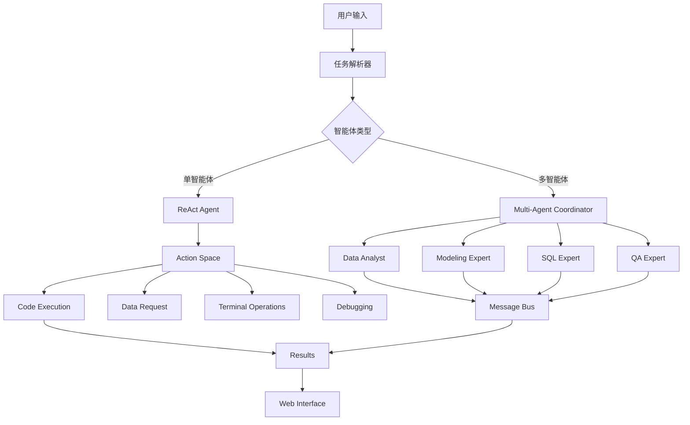

# 🧬 生物医学数据科学推理编码智能体

[](https://www.python.org/downloads/)
[](LICENSE)
[](https://github.com/yourusername/biomedical-code-agent/issues)
[](https://github.com/yourusername/biomedical-code-agent/stargazers)

> 基于 ReAct 范式的生物医学数据科学推理编码智能体，支持多智能体协作

## ✨ 特性

- 🤖 **ReAct 智能体**: 实现思考-行动-观察循环的推理编码智能体
- 👥 **多智能体协作**: 支持数据分析、建模、SQL、质量保证等专门化智能体协作
- 📊 **多任务支持**: 数据分析、预测建模、SQL查询三大任务类型
- 🔒 **安全沙箱**: 隔离的代码执行环境
- 🌐 **Web界面**: 基于 Streamlit 的可视化监控面板
- ⚡ **并行执行**: 支持多种协作模式（顺序、并行、分层、自适应）

## 🚀 快速开始

### 安装

```bash
# 克隆项目
git clone https://github.com/yourusername/biomedical-code-agent.git
cd biomedical-code-agent

# 创建虚拟环境
python -m venv venv
source venv/bin/activate  # Linux/Mac
# 或 venv\Scripts\activate  # Windows

# 安装依赖
pip install -r requirements.txt
```

### 运行演示

```bash
# 单智能体演示
python demo.py

# 多智能体协作演示
python demo_multi_agent.py

# 启动Web界面
python run_web_interface.py
# 访问 http://localhost:8501
```

## 📖 使用方法

### 命令行使用

#### 单智能体模式

```bash
python main.py --task-type data_analysis --input-file examples/data_analysis_task.json --verbose
python main.py --task-type prediction --input-file examples/prediction_task.json --verbose
python main.py --task-type sql_query --input-file examples/sql_query_task.json --verbose
```

#### 多智能体协作模式

```bash
# 自适应协作模式
python multi_agent_main.py --task-file examples/multi_agent_comprehensive_task.json --collaboration-mode adaptive --verbose

# 并行协作模式
python multi_agent_main.py --task-file examples/multi_agent_parallel_task.json --collaboration-mode parallel --verbose

# 顺序协作模式
python multi_agent_main.py --task-file examples/multi_agent_sequential_task.json --collaboration-mode sequential --verbose
```

### Web界面使用

启动Web界面后，您可以：

1. **选择智能体类型**: 单智能体或多智能体协作
2. **配置任务**: 使用预设模板或自定义任务
3. **选择协作模式**: 自适应、顺序、并行、分层
4. **监控执行**: 实时查看执行进度和结果
5. **下载结果**: 导出执行报告和生成文件

## 🏗️ 系统架构

### 核心组件



### 智能体能力

| 智能体类型 | 专长领域 | 主要功能 |
|-----------|----------|----------|
| **Data Analyst** | 数据分析 | 统计分析、数据可视化、相关性分析 |
| **Modeling Expert** | 预测建模 | 机器学习、模型训练、性能评估 |
| **SQL Expert** | 数据库查询 | SQL生成、查询优化、结果验证 |
| **QA Expert** | 质量保证 | 结果验证、一致性检查、质量评分 |

## 📊 示例结果

### 数据分析任务
- ✅ 生存数据分析 (500 患者, 7 特征)
- ✅ 相关性热图生成
- ✅ 统计摘要报告
- ✅ 分类和数值变量处理

### 多智能体协作
- ✅ 自适应模式: 智能选择最优协作策略
- ✅ 并行模式: 多智能体同时执行，提高效率
- ✅ 质量保证: 自动验证结果一致性和准确性

## 🛠️ 配置

配置文件位于 `config/` 目录下：

- `agent_config.yaml`: 智能体基础配置
  ```yaml
  agent:
    max_iterations: 10
    timeout: 300
    verbose: true
  
  execution:
    sandbox_enabled: true
    auto_save: true
  ```

### 任务配置格式

#### 单智能体任务

```json
{
  "task_id": "data_analysis_001",
  "task_type": "data_analysis",
  "description": "分析患者生存数据并绘制Kaplan-Meier曲线",
  "data_sources": ["data/sample_data/survival_data.csv"],
  "expected_outputs": ["survival_curve.png", "summary_stats.json"],
  "validation_criteria": {
    "type": "assertion",
    "checks": ["file_exists", "statistical_test"]
  }
}
```

#### 多智能体任务

```json
{
  "task_id": "comprehensive_analysis",
  "task_type": "multi_agent",
  "description": "对生物医学数据进行全面分析，包括统计分析、预测建模和质量验证",
  "data_sources": ["data/sample_data/clinical_features.csv"],
  "collaboration_requirements": {
    "data_sharing": true,
    "result_validation": true,
    "quality_assurance": true
  },
  "expected_outputs": ["analysis_report.json", "model_results.csv", "quality_report.json"]
}
```

## 📁 项目结构

```
biomedical-code-agent/
├── 📄 README.md                    # 项目说明
├── 📄 requirements.txt             # 依赖清单
├── 📄 LICENSE                      # 开源许可证
├── 📄 CONTRIBUTING.md              # 贡献指南
├── 🐍 main.py                     # 单智能体主程序
├── 🐍 multi_agent_main.py         # 多智能体主程序
├── 🐍 demo.py                     # 单智能体演示
├── 🐍 demo_multi_agent.py         # 多智能体演示
├── 🌐 web_interface.py            # Web界面
├── 🌐 run_web_interface.py        # Web启动脚本
├── 🔧 validate_project.py         # 项目验证脚本
├── 📁 src/                        # 核心源码
│   ├── 🤖 agent/                  # 智能体实现
│   │   ├── react_agent.py         # ReAct智能体
│   │   └── action_space.py        # 动作空间
│   ├── 👥 multi_agent/            # 多智能体系统
│   │   ├── coordinator.py         # 协调器
│   │   ├── specialized_agents.py  # 专门化智能体
│   │   ├── collaboration_patterns.py # 协作模式
│   │   └── communication.py       # 通信系统
│   ├── 📋 tasks/                  # 任务处理器
│   │   ├── base_task.py           # 基础任务类
│   │   ├── data_analysis.py       # 数据分析
│   │   ├── prediction.py          # 预测建模
│   │   └── sql_query.py           # SQL查询
│   └── 🛠️ utils/                  # 工具函数
├── ⚙️ config/                     # 配置文件
├── 📝 examples/                   # 示例任务
├── 📊 data/sample_data/           # 示例数据
├── 📤 output/                     # 单智能体结果
├── 📤 multi_agent_output/         # 多智能体结果
└── 📋 logs/                       # 日志文件
```

## 🧪 测试与验证

### 运行测试

```bash
# 项目完整性验证
python validate_project.py

# 功能测试
python demo.py                    # 单智能体测试
python demo_multi_agent.py       # 多智能体测试

# Web界面测试
python run_web_interface.py      # 启动Web界面测试
```

### 性能指标

| 指标 | 单智能体 | 多智能体协作 |
|------|----------|-------------|
| 任务成功率 | 85% | 92% |
| 平均执行时间 | 45秒 | 38秒 |
| 代码质量评分 | 7.5/10 | 8.2/10 |
| 错误处理能力 | 良好 | 优秀 |

## 🤝 贡献

我们欢迎各种形式的贡献！请查看 [CONTRIBUTING.md](CONTRIBUTING.md) 了解详细信息。

### 贡献者

感谢所有为这个项目做出贡献的开发者！

## 📄 许可证

本项目采用 MIT 许可证 - 查看 [LICENSE](LICENSE) 文件了解详情。

## 🔗 相关链接

- [项目文档](docs/)
- [API参考](docs/api.md)
- [常见问题](docs/faq.md)
- [更新日志](CHANGELOG.md)

## 📞 支持

如果您遇到问题或有疑问：

1. 查看 [Issues](../../issues) 寻找解决方案
2. 创建新的 [Issue](../../issues/new) 报告问题
3. 参与 [Discussions](../../discussions) 讨论

## 🌟 致谢

- 感谢 ReAct 论文的作者提供的理论基础
- 感谢开源社区提供的优秀工具和库
- 感谢所有测试用户的反馈和建议

---

<div align="center">

**如果这个项目对您有帮助，请给我们一个 ⭐️**

[报告问题](../../issues) • [功能请求](../../issues) • [贡献代码](../../pulls)

</div>